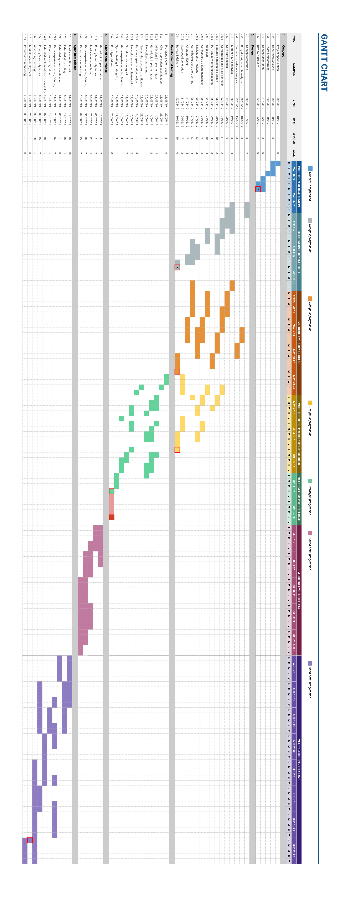

# Technical Design Document

> FRONT PAGE

##	1. Project Goal
Our game aims to provide an online multiplayer experience on Android devices (as described in the **Client Side** section of this document). From a technical standpoint, the game aims to offer 24\7 worldwide availability for all the online features, such as searching for and joining online matches, customizing player profiles, accessing leaderboards and collectible lists.

## 2. Provided Services (besides the game)
In addition to the game itself, we provide a complete Google Play Games integration to ease access to leaderboards and achievements.

##	3. Client Side

###	3.1	Hardware requirements
The minimum hardware requirements are low-to-mid-range smartphones, with the following specifications:
* At least 50MB of free internal storage
* A 3G or Wi-Fi Internet connection
* At least 1GB of RAM

###	3.2	Software requirements
The game requires at least Android 5.0 (API level 21). More details on the decision can be found in the **Platform** and **System Requirements** section of the GDD.

##	4. Workload estimation
The online part of the game is composed of a classic client-server system, with the server hosted on the Google Firebase platform. 
The rollout plan consists of an open beta phase, to test and improve the game based on user feedback, and a release phase, when the game will be fully available to anyone through the Google Play Store.

The open beta phase will be rolled out through the Google Play Beta Test Management plan, to make our game readily available on the most trusted source for Android apps.
* Expected average number of daily players: 1,000
* Expected average number of simultaneous players: 500
* Expected number of total players: 5,000

On release, we expect an increase in the number of players
* Expected average number of daily players: 15,000
* Expected average number of simultaneous players: 4,500
* Expected number of total players: 25,000 

Each match is played on the server. Each player sends the server their move, that is then verified and executed. The results are sent back to the client and then visualized on the player's screen. Since this must happen quasi-real-time, each user (or better, each match) has enough dedicated resources to be able to compute everything in the required time. Since everything is hosted on the Firebase platform, resources are allocated and paid as needed.

[comment]: # (Target workload for your infrastructure in term of total users, peak users, and resources dedicated to each user. Starting from an initial system capacity and extend later is fine but then you must provide an extension plan. MOTIVATE THIS referencing the GDD)

##	5. Frontend

The frontend receives all the players' interaction and sends them to the correct backend service to be handled. Players will access frontend services from the game itself, logging in with their Google account through the Google Play Games platform. The authentication service is provided by the Google Play Games services and provides us with information on the player's account ID, display name and profile image. 

###	5.1	Platforms
Our solution of choice is a Platform-as-a-Service set of products, Firebase, provided by Google. Firebase lets us deploy our frontend services to their Functions product, that will be used for both the frontend and the backend.

###	5.2	Scalability and Extensibility
Since our solution of choice is the Firebase cloud platform, the system automatically scales according to the needs of our userbase. In case of an increase in the number of players, Firebase automatically adjusts the provided compute time to suit our needs.

##	6.	Backend
Our game uses three main backend services and two external components. The external components are used to handle user authentication and microtransaction and are both provided by Google, that lets us have information about the player and confirmation of successful transactions.  
Our services are:
* Matchmaking: a matchmaker will pair players and create an instance of their game in our Game Service, making them able to play competitively.
* Game Service: this service receives player moves, validates them, makes changes to the game board according to the information received and sends the result back to the client. It is the core of the online game experience.
* User Database: a database containing all the information regarding our players, like their achievements, their win\loss ratio and their collected cards. It also has a secondary database used as backup.

###	6.1	Platforms
As said in the **Frontend** section, we use Firebase as our cloud platform of choice. The decision was made after considering what best suits our needs for an affordable, scalable and easily manageable backend platform. We chose Firebase because it has low initial costs (most of its products are free under a certain data threshold) and fine-grained billing plans, is very well integrated with the whole Google environment (since it is also owned by Google) and provides a specific SDK for game development in Unity.   
Once this choice is done, we have no control on which software Firebase uses but we can access all of their products, many of which have, as previously stated, a monthly usage threshold under which they are provided for free.

###	6.2	Software

| Service | Solution |   Reason   |
| -- | -- | -- |
| Matchmaking | Realtime Database | This service provides a very fast NoSQL database, focused on real-time data availability. This lets us handle the pairing and creation of matches without having the users wait in long queues before playing. |
| Game Service | Cloud Functions  | This service lets us host our game matches on Firebase's servers, reacting to actions like player moves or match timeouts.  |
| User Database | Cloud Firestore | This service provides a robust cloud-hosted NoSQL database with efficient queries and offline availability, letting us store all player data while also making them accessible in a read-only fashion while the user is offline.  |

###	6.3	Workload capacity
Since our backend is completely cloud-based, we can expect new computational power and storage space to be provided as needed. So, the system should be capable of handling a very large amount of simultaneous matches should the need arise.

##	7.	Development

###	7.1	Hardware
| Product | Quantity | Cost per Unit | Usage |
| -- | -- | -- |
| Dell Precision 3630 Tower | 6 | € 909 | High performance desktop workstation for the whole team. Mouse and keyboard included. |
| Dell UltraHD 24 - P2415Q | 6 | € 465 | High resolution and color accurate screen for the whole team. |
| Wacom Cintiq 16 | 1 | € 600 | Professional display with pen for artistic work. |

###	7.2	Software
| Product | Quantity | Cost |
| -- | -- | -- |
| Unity Pro | 5 | € 115 per month per seat |
| Visual Studio Professional | 1 | € 1200 first year |
| Adobe Creative Cloud All Apps | 1 | € 70 per month per seat |

###	7.3	Development Gantt

##	8.	External Services
To simplify our network and to avoid potential mismanagement of heavily sensitive data, we delegate the payment service to Google, the publisher of our game. This has no upfront cost (except for the € 25 license needed to publish the game) but Google takes 30% out of every transaction as management fees.

##	9.	Communication	

###	9.1	Global Infrastructure Outline
[comment]: # (How servers are connected (hint: use a picture What is installed on each server)

###	9.2	Network Requirements
Bandwidth, latency, type of connection, QoS in general
Inside and outside your infrastructure

##	10.	Delivery

###	10.1	Estimated Delivery Time
To be compliant with your GANTT

###	10.2	Delivery Platform
The game will be delivered through the Google Play store.

###	10.3	Delivery Methodology
This is about how you are going to use your distribution channel

##	11.	Staff

###	11.1	For Infrastructure Setup
Cloud services developer

###	11.2	For Infrastructure Management
System Administrator

###	11.3	In Game
Senior Game Designerx2
Game Developer
Graphic Artist